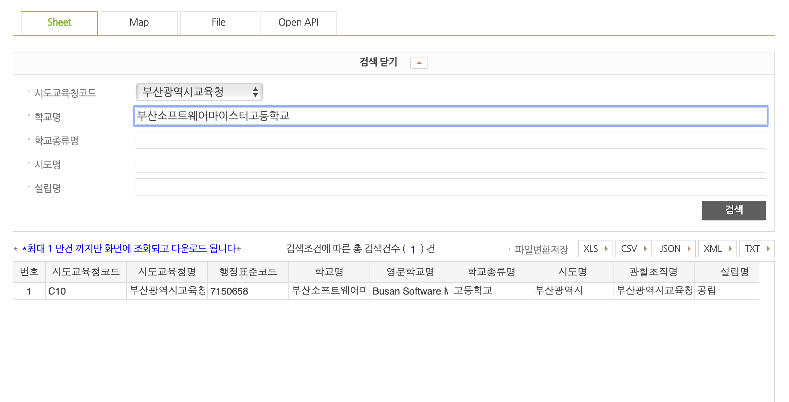

# neisScheduleToICS
나이스 학사일정을 ICS(iCalendar) 파일로 변환해주는 프로그램입니다. 해당 프로그램을 이용해 더욱 쉽게 학교 학사일정을 캘린더에 추가하고, 알림을 받아 보실 수 있습니다.

Service URL(부산소프트웨어마이스터고등학교) : [https://obtuse.kr/api/calendar/school?ATPT_OFCDC_SC_CODE=C10&SD_SCHUL_CODE=7150658](https://obtuse.kr/api/calendar/school?ATPT_OFCDC_SC_CODE=C10&SD_SCHUL_CODE=7150658)
다른 학교도 시도교육청코드와 표준행정코드를 변경하여 사용하실 수 있습니다.

-   ATPT_OFCDC_SC_CODE = 시도교육청코드
-   SD_SCHUL_CODE = 표준행정코드

## 프로젝트 구조

이 프로젝트는 모듈화된 구조로 각 컴포넌트의 역할과 책임이 명확히 분리되어 있습니다:

```
├── main.py              # 애플리케이션 진입점
├── config/              # 설정 관리
│   ├── __init__.py
│   └── settings.py      # 설정 로딩 및 관리
├── models/              # 데이터 모델
│   ├── __init__.py
│   ├── entities.py      # 비즈니스 엔티티
│   └── schemas.py       # API 요청/응답 스키마
├── services/            # 비즈니스 로직 서비스
│   ├── __init__.py
│   ├── neis_service.py  # NEIS API 상호작용
│   ├── ics_service.py   # ICS 파일 변환
│   ├── school_service.py # 학교 데이터 관리
│   └── cache_service.py # 캐싱 관리
├── utils/               # 유틸리티 함수
│   ├── __init__.py
│   ├── date_utils.py    # 날짜 처리
│   └── file_utils.py    # 파일 시스템 작업
├── api/                 # API 라우트
│   ├── __init__.py
│   └── routes.py        # FastAPI 엔드포인트
├── templates/           # HTML 템플릿
├── data/               # 학교 데이터 파일
└── server.py           # 레거시 단일 파일 (호환성을 위해 유지)
```

## 실행 방법

### 요구사항
- Python 3.8 이상
- 필요한 패키지들 (requirements.txt 참고)

### 설정
1. `config.json` 파일을 생성하고 NEIS API 키를 설정합니다:
```json
{
  "neisKey": "your-neis-api-key-here",
  "cache_day": 7
}
```

### 서버 실행
```bash
# 의존성 설치
pip install -r requirements.txt

# 서버 실행 (모듈화된 버전)
uvicorn main:app --host 0.0.0.0 --port 8000

# 또는 레거시 버전
uvicorn server:app --host 0.0.0.0 --port 8000
```

### API 사용법
- 웹 인터페이스: `http://localhost:8000`
- 학교 검색: `POST /search`
- ICS 파일 다운로드: `GET /school?ATPT_OFCDC_SC_CODE={코드}&SD_SCHUL_CODE={코드}`

## 시도교육청코드 / 행정표준코드 조회방법

-   [https://open.neis.go.kr/portal/data/service/selectServicePage.do?page=1&rows=10&sortColumn=&sortDirection=&infId=OPEN17020190531110010104913&infSeq=1](https://open.neis.go.kr/portal/data/service/selectServicePage.do?page=1&rows=10&sortColumn=&sortDirection=&infId=OPEN17020190531110010104913&infSeq=1)에 접속해서 시도교육청코드와 행정표준코드를 조회할 수 있습니다.
-   [](image.png)

### 작동 테스트
- 애플 캘린더 : ✅
- 구글 캘린더 : ✅
- 아웃룩 : ❌ (ics파일을 직접 업로드하면 일정 제목이 표시되지 않고 작동함, 웹으로 구독은 작동하지 않음)
- 네이버 캘린더 : ❌
- Notion Calendar : ✅(구글 캘린더와 api연결, Notion Calendar연동)

(다른 캘린더에서도 작동하지 않는다면 Issue 등록해주시면 감사하겠습니다.)
(해결해서 Pull Requst 보내주시면 더 감사하겠습니다.)

## 레거시 파일 참고

이 프로젝트는 기존 단일 파일 구조에서 모듈화된 구조로 리팩토링되었습니다:

### Python 버전
-   `server.py` : 기존 단일 파일 (147줄, 호환성을 위해 유지)
-   `main.py` + 모듈들 : 새로운 모듈화 구조 (354줄, 16개 파일)

### JavaScript 레거시 (.legacy 폴더)

## simple.js 사용법

-   나이스 학사일정 api를 이용해 학사일정을 json형식으로 가져옵니다.
-   simple.js에 jsonData 변수에 json형식으로 가져온 학사일정을 넣어줍니다.
-   `node index.js`를 실행하면 ics파일이 생성됩니다.
-   해당 파일을 개인적으로 사용하거나 서버에 배포하여 사용하시면 됩니다.

## index.js 사용법

-   config.json에 나이스 api key와, 시도교육청코드, 행정표준코드를 입력합니다.
-   `node index.js`를 실행하면 ics파일이 생성됩니다.
-   해당 파일을 개인적으로 사용하거나 서버에 배포하여 사용하시면 됩니다.

## server.js 사용법

-   server.js를 실행하면 api 서버가 실행됩니다.
-   http://localhost:3007/school?ATPT_OFCDC_SC_CODE=시도교육청코드&SD_SCHUL_CODE=표준행정코드 로 접속하면 ./cache/시도교육청코드/표준행정코드.ics 파일이 캐싱되며, ics파일이 응답됩니다.
-   예시(부산소프트웨어마이스터고) /school?ATPT_OFCDC_SC_CODE=C10&SD_SCHUL_CODE=7150658
-   캐싱된 파일은 기본적으로 7일간 유효하며, 캐싱기간 동안 같은 학교의 학사일정을 요청하는 경우 같은 파일을 제공합니다.
-   캐싱기간을 변경하고 싶다면 server.js의 cacheTime 변수를 변경하면 됩니다.
